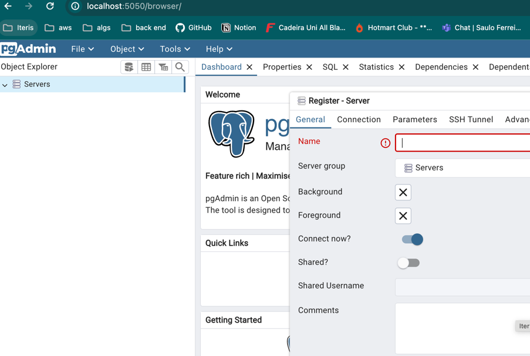

In order to have the environment configured for this project you will need:

- Docker (docker desktop for macs)
- Java version 17

// TODO mudar para goparty!

Steps to run the project in your local machine
- run the command `docker compose up` (need to have docker desktop running if you are mac user)
- then run via terminal() or Intelij

To access the database via terminal:

` docker exec -it event-ticket-api-postgres-1 psql -U myuser -d mydatabase
`
Some useful commands:
`\l` --> List all the databases
`\c` --> connect to a database
`\dt` --> list tables available

To access redis through redis cli:
`
docker exec -it event-ticket-api-redis-1 redis-cli
`

Diagram:

TODO:
- [x] os eventos não tem uma quantidade total de tickets, implementar.
- [ ] marcação de eventos populares(a cada hora atualiza e marca com os 3 mais vendidos)
- [ ] implementar serviço de recomendação de eventos para usuário dado um determinado raio
- [ ] adicionar cache no redis para intenção de compra
  - [x] cache de consulta de orders por usuário
  - [ ] cache de eventos populares(marcar como evento popular)
  - [ ] Cache de tickets disponíveis por evento (verificação de disponibilidade) 
   💡 Justificativa:
    Evita varreduras pesadas na tabela Ticket para cada visitante.

    Atualizar o cache via evento assíncrono (quando alguém compra ou cancela).
    ⚠️ Importante:
    Deve ser invalidação proativa, não só por TTL, pois dados mudam com frequência.
- [ ] Adicionar filas (RabbitMq, Kafka)
- [ ] adicionar pacote valid do spring para os dto's
- [x] rest controller advice para tratamento de erros
- [ ] adicionar qrcode para ingresso
- [ ] adicionar testes na aplicação (unitários e integração)
- [ ] fazer deploy(flyio)
- [ ] adicionar CI(Jenkins ou circleCI)
- [ ] ter logs na aplicação
- [ ] adicionar método pagamento(Stripe por exemplo)

Apenas ideias de fila:
1. 🎟 Emissão de ingresso (Ticket Issued Event)
   📌 Cenário:
   Após uma Order ser confirmada, os ingressos precisam ser gerados e associados ao usuário.

✅ Solução:
O controller cria a Order, envia evento para a fila:

json
Copiar
Editar
{
"orderId": "...",
"userId": "...",
"eventId": "...",
"tickets": 2
}
Um worker consumidor gera os Tickets e atualiza o banco.

🎯 Vantagens:
Permite escalar geração de tickets separadamente.

Reduz latência da criação de Order.

Se falhar, pode reprocessar a fila.

2. 📩 Envio de e-mail de confirmação de pedido
   📌 Cenário:
   Usuário finaliza o pedido → precisa receber um e-mail com os ingressos.

✅ Solução:
Após o Order ser salvo, envia evento:

scss
Copiar
Editar
OrderConfirmedEvent(orderId, userEmail)
Um microserviço separado consome isso e envia o e-mail.

🎯 Vantagens:
Desacopla envio de e-mail da lógica do core.

Evita travar resposta HTTP só por causa do e-mail.

Pode ser reprocessado em caso de falha no SMTP.

3. 📉 Atualização de estoque de ingressos
   📌 Cenário:
   Eventos têm um número limitado de ingressos. Precisa atualizar o estoque de forma segura.

✅ Solução:
Após um ticket ser emitido, envia:

scss
Copiar
Editar
TicketSoldEvent(eventId, quantity)
Um consumidor atualiza a contagem de ingressos restantes (eventualmente em cache/Redis).

🎯 Vantagens:
Permite manter um sistema separado de contagem em tempo real (mais performático).

Reduz consultas pesadas no banco em tempo de leitura.

4. 🧾 Processamento assíncrono de pagamento (se houver integração)
   📌 Cenário:
   Order criada, mas pagamento é processado por um provedor externo.

✅ Solução:
Envia PaymentRequestedEvent.

Um serviço escuta, chama o gateway de pagamento (ex: Stripe, PagSeguro).

Quando o pagamento for concluído, envia outro evento PaymentConfirmedEvent.

🎯 Vantagens:
Total desacoplamento entre core e pagamento.

Facilita retries e tolerância a falhas do provedor.

5. 📊 Logs de auditoria e eventos para analytics
   📌 Cenário:
   Registrar ações importantes: compra, login, falha no pagamento, etc.

✅ Solução:
Em vez de logar no banco diretamente, envie eventos:

json
Copiar
Editar
{
"type": "ORDER_PLACED",
"userId": "...",
"timestamp": "...",
"metadata": {...}
}
Um microserviço ou serviço externo (Kafka consumer) grava isso em banco separado ou envia para um data warehouse.

🎯 Vantagens:
Reduz acoplamento com banco de logs.

Permite coletar analytics em tempo real (útil com Kafka Streams).

6. ⚠️ Monitoramento de falhas e alertas
   📌 Cenário:
   Uma falha no sistema (ex: ticket duplicado, tentativa de fraude) precisa gerar alerta.

✅ Solução:
Produz um evento SecurityAlertEvent ou SystemErrorEvent.

Um consumidor envia alerta para Slack, email ou painel de monitoramento.

RabbitMQ vs Kafka: qual usar?
Situação	RabbitMQ	Kafka
Enfileiramento com retry	✅ Excelente	⚠️ Mais complexo
Comunicação entre serviços (assíncrona)	✅ Simples e confiável	⚠️ Mais voltado a streaming
Alta vazão de eventos e logs	⚠️ Limitado	✅ Ideal para isso
Garantia de ordenação em partições	⚠️ Limitada	✅ Sim
Casos event-driven simples	✅ Melhor escolha	⚠️ Pode ser overkill

Fila para envio de emails apos compra 

