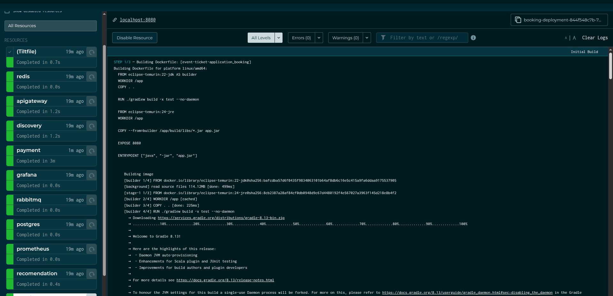
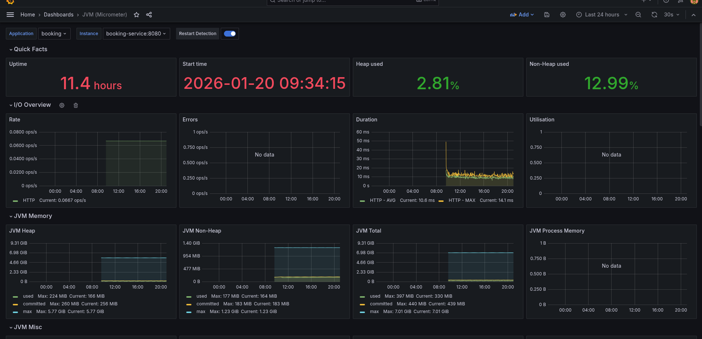
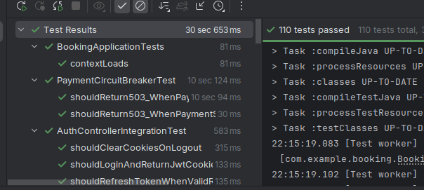

# Ticket API - Event Ticketing System


All service run using [Tilt](https://tilt.dev/) in order to run a local kubernetes environment.




## System Architecture Overview

The system is designed using a microservices' architecture. It utilizes asynchronous messaging for decoupling services and RESTful synchronous calls for critical, real-time operations.

### Architecture Diagram


## Main Components

* **API Gateway**: Acts as a unified entry point and reverse proxy. It routes external requests to the appropriate internal microservices based on the request path, abstracting the internal network topology.
* **Ticket API (Core)**: Handles CRUD operations for events, tickets, and users. It serves as the **Authentication Authority** (Spring Security) and manages the business logic for reservations and event location data.
* **Payment Service**: Consumes messages regarding ticket reservations and processes payments via Stripe. It ensures data consistency using the **Saga Pattern** (Choreography). Specifically, it handles **expired invoices** (e.g., user abandonment): if a payment session expires, a compensation event is published to release the reserved stock automatically.
* **Event Recommendation Service**: Listens for new event location data and provides personalized recommendations to users based on proximity.
* **Geolocation API**: External service used to convert city/address names to latitude and longitude during event registration.
* **Cache (Redis)**: Implements caching strategies for high-demand data such as available tickets, popular events.
* **Messaging Queue (RabbitMQ)**: Facilitates asynchronous communication between services (e.g., notifying the payment service when a ticket is reserved or when a compensation transaction is required).
* **Databases**:
  * **PostgreSQL**: Stores relational data including Users, Tickets, and Orders.
  * **MongoDB**: Stores unstructured data optimized for geospatial queries in the Recommendation Service.

## Service Discovery and Routing

This project utilizes the Spring Cloud ecosystem to manage microservice communication dynamically, solving the problem of hardcoded IP addresses.

### Eureka Server (Service Discovery)
In a dynamic containerized environment, IP addresses and ports can change. The Eureka Server acts as a service registry.
1.  **Registration**: When a microservice (e.g., Ticket API) starts up, it registers its current host and port with Eureka.
2.  **Discovery**: The Gateway queries Eureka to resolve the location of the target service using its Service ID (e.g., `TICKET-API`).

### Spring Cloud Gateway
The Gateway serves as a **Reverse Proxy**, simplifying the client-side consumption of the API.
1.  **Unified Entry Point**: Instead of managing multiple endpoints and ports (e.g., `localhost:8081`, `localhost:8082`), the client communicates with a single host.
2.  **Dynamic Routing**: The Gateway intercepts requests (e.g., `/api/v1/tickets`) and dynamically forwards them to the correct microservice instance resolved by Eureka.

## Security & Authentication

The application prioritizes security by implementing stateless authentication using **Spring Security**.

**Mechanism:**
* **JWT (JSON Web Token)**: Used for stateless authentication.
* **HttpOnly Cookies**: Unlike local storage, JWTs are stored in `HttpOnly` cookies. This prevents client-side scripts from accessing the token, significantly mitigating the risk of **XSS (Cross-Site Scripting)** attacks.
* **Flow**: Upon successful login, the server sets a secure cookie containing the JWT. This cookie is automatically sent by the browser in subsequent requests to secured endpoints.

The system includes a comprehensive monitoring stack to ensure reliability and performance. We use **Micrometer** to collect metrics, **Prometheus** for storage, and **Grafana** for visualization.

## Ticket Validation (QR Code)

To ensure the authenticity of tickets and prevent fraud, the system implements a cryptographic validation flow.

1.  **Generation**: When a ticket is purchased, a unique hash is generated containing signed ticket data.
2.  **Visualization**: This hash is encoded into a QR Code presented to the user.
3.  **Validation**: Event organizers use a specific endpoint to scan the QR Code, verifying if the ticket is valid and hasn't been used yet.


## Resilience & Fault Tolerance

- Circuit Breakers – Resilience4j
- Graceful degradation for external dependencies
- Retry and timeout policies

## Observability & Monitoring
The system includes a comprehensive monitoring stack to ensure reliability and performance. We use Micrometer to collect metrics, Prometheus for storage, and Grafana for visualization.

You can acess grafana in http://localhost:3000 then go to [dashboards](http://localhost:3000/dashboards) in order to see JVM measures


The board have informations such as IO, Error rating, duration etc.


## Testing
The main service has about 110 tests(unit and integration), the other app are tested as well


## Prerequisites
* **Java 24**: The application runtime is optimized for Java 24 to leverage recent performance improvements.
* **Java 22**: Used for building the application.
* **Docker & Docker Compose**: For running infrastructure services.
* **Tilt**: For local Kubernetes orchestration (Optional but recommended).
* **Stripe CLI**: For local webhook testing.

## Execution

### Using Tilt

Tilt automates the feedback loop for local Kubernetes development.

1.  **Prerequisites:** Ensure you have a local Kubernetes cluster running.  
    Recommended options:
    * [Docker Desktop](https://www.docker.com/products/docker-desktop/) (Easiest, just enable Kubernetes in settings)
    * [Minikube](https://minikube.sigs.k8s.io/docs/start/)
    * [Kind](https://kind.sigs.k8s.io/docs/user/quick-start/) (Lightweight, runs in Docker)

2.  Run the command in the root directory:
    ```bash
    tilt up
    ```

3.  Access the **Tilt dashboard** (press `Space` in the terminal) to monitor logs and service status.

### Manual Execution & Webhooks

To test payments locally, you need to forward Stripe events to your local instance:

```bash
stripe listen --forward-to localhost:8083/payments/webhooks
```

## API Documentation

Once the application is running, the OpenAPI (Swagger) documentation is available at:

* **Swagger UI**: `http://localhost:8081/swagger-ui/index.html`

Here is the usage flow section for your README.

### Usage Flow

A complete API collection compatible with **Bruno** can be found in the `EventTicketApiCollection` directory.

**1. User Registration and Authentication**
First, register a new user in the system. After registration, authenticate to receive the access token required for subsequent requests.

* **Signup:** `POST http://localhost:8081/booking/api/auth/signup`
* **Signin:** `POST http://localhost:8081/booking/api/auth/signin`

**2. Event and Ticket Management**
Create a new event and subsequently issue the inventory of tickets available for that event.

* **Create Event:** `POST http://localhost:8081/booking/api/events`
* **Issue Tickets:** `POST http://localhost:8081/booking/api/tickets`

**3. Ordering and Payment**
Create an order to purchase tickets. The response will contain a Stripe Checkout URL. Since this is a test environment, you may purchase as many tickets as desired using test credentials.

* **Create Order:** `POST http://localhost:8081/booking/api/orders`

Once the payment is completed via the Stripe URL, a webhook notifies the main service to automatically update the status of both the order and the tickets to confirmed.

**4. Check-in Process**
The application features a secure check-in system. You can generate a QR code for a specific ticket, which produces a unique 4-letter hash. This hash must be validated against the check-in endpoint to admit the attendee. This process prevents a ticket from being used more than once.

* **Generate QR Code:** `GET http://localhost:8081/booking/api/tickets/{{ticketId}}/qrcode`
* **Validate Check-in:** `POST http://localhost:8081/booking/api/tickets/checkin/{{ticketId}}`

## Project Roadmap / Status

### Implemented Features

**Core & Architecture**

* [x] Implementation of Security Headers.
* [x] Spring Security Authentication via HttpOnly Cookies (JWT).
* [x] Database versioning/migrations using Flyway.
* [x] Usage of UUIDs for entity identifiers.
* [x] Global Exception Handler implementation.
* [x] Structured Logging.
* [x] Tilt configuration for local Kubernetes development.
* [x] Role-Based Access Control (RBAC) implementation.
* [x] Virtual Threads (Project Loom) adoption.
* [x] Comprehensive API Documentation with Swagger/OpenAPI.

**Ticket API & Business Logic**

* [x] Advanced JPQL/Native queries using DTO projections and Entity Manager.
* [x] Proper HTTP Status code handling (409 Conflict, 422 Unprocessable Entity).
* [x] Swagger @Schema documentation for Requests/Responses.
* [x] Refactoring of Controller DTOs (Request/Response separation).
* [x] QR Code generation for ticket validation (with hash).

**Performance & Caching (Redis)**

* [x] Popular events caching (updates hourly).
* [x] User order lookup caching.
* [x] Ticket availability caching.
* [x] Purchase intent caching (concurrency control).

**Microservices & Integrations**

* [x] Recommendation Service based on geolocation radius.
* [x] Stripe Payment integration.
* [x] Payment Webhook handling. When payment is confirmed, the main service receives the notification via webhook regarding the transaction status.
* [x] Saga Pattern (Compensation): Robust handling of failed payments and **expired invoices**, ensuring reserved tickets are automatically released back to stock.
* [x] Circuit Breaker implementation (Resilience4j).

**Quality Assurance & Observability**

* [x] Spring Validation for DTOs.
* [x] RestControllerAdvice for unified error handling.
* [x] Unit and Integration Tests.
* [x] Monitoring stack: Micrometer + Grafana + Prometheus.

### Future Improvements

* [ ] Move authentication logic to API Gateway.
* [ ] Expand test coverage for edge cases in the payment module.
