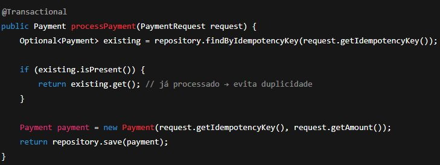
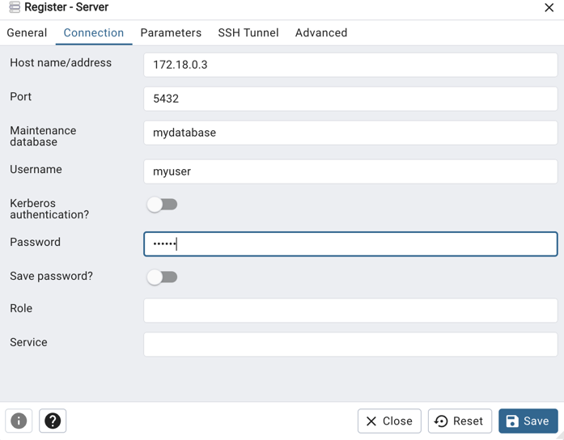

In order to have the environment configured for this project you will need:

- Docker (docker desktop for macs)
- Java version 17

Steps to run the project in your local machine
- run the command `docker compose up` (need to have docker desktop running if you are mac user)
- then run via terminal() or Intelij

To access the database via terminal:

` docker exec -it booking-clean-arch-postgres-1 psql -U myuser -d mydatabase
`
Some useful commands:
`\l` --> List all the databases
`\c` --> connect to a database
`\dt` --> list tables available

To access the database via PgAdmin:
- Access pg admin in this link(docker must be running) [link](http://localhost:5050/)
- Register a server
  
  - Then go to connection
  
  - You need to fill those 
    - To get the Host name/address you need to:
      - Run `docker ps`
      - Get the port with `docker inspect <ID_FROM_PG_ADMIN_CONTAINER> | grep IPAddress`
  
      
