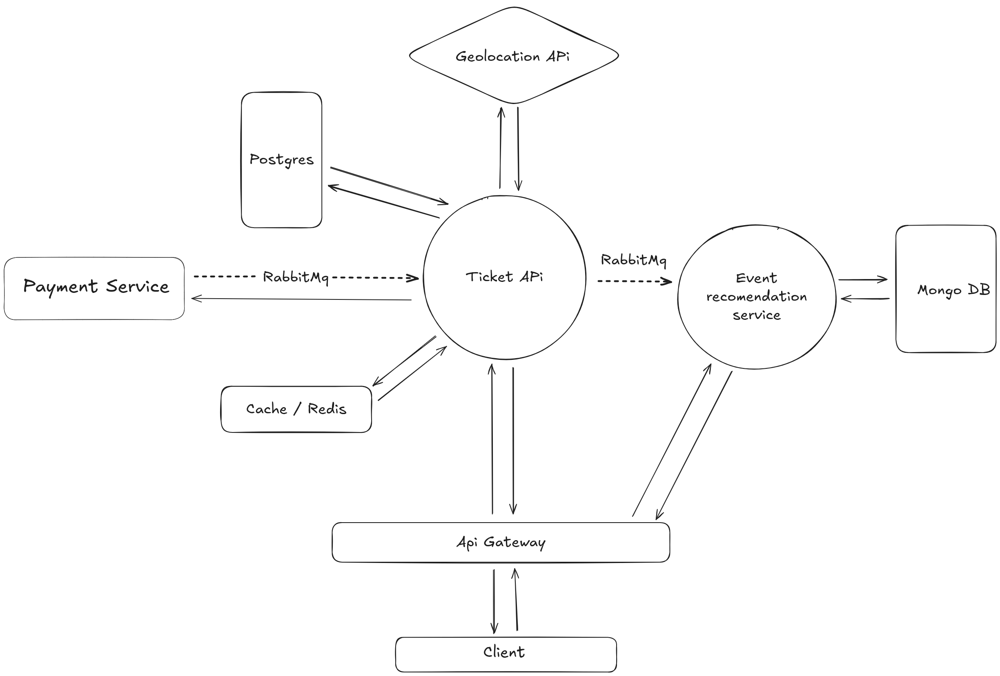

# Ticket API - Event Ticketing System

This is the main microservice responsible for managing the ticketing system, including:

- Event creation
- User registration
- Ticket storage
- Communication with recommendation and geolocation services

## 📌 System Architecture Overview

The system is designed using a microservices architecture with asynchronous messaging and RESTful synchronous calls for critical operations.

## ⚙️ Main Components

- **Ticket API (this project)**: Handles CRUD operations for events, tickets, and users. Stores event location (latitude/longitude).
- **Event Recommendation Service**: Listens for event location data and recommends nearby events based on user location.
- **Geolocation API**: Converts city/address names to latitude and longitude; used when registering events.
- **Cache (Redis)**: Used to cache ticket and recommendation data for performance.
- **Databases**:
    - PostgreSQL: Stores structured ticketing data.
    - NoSQL (e.g., MongoDB): Stores event data optimized for geolocation queries.
- **Messaging Queue**: (e.g., Kafka or RabbitMQ) Used to asynchronously send new event location data to the recommendation service.

## 🔄 Service Communication

- When an event is created, its location is saved and a lightweight message (lat, long, eventId) is sent to the recommendation service via a messaging topic.
- The client can request event recommendations by providing the current latitude and longitude.
- The recommendation service performs a geolocation query and returns nearby events.

---

## ✅ TODO

* [x] Implement **Security Headers** ([https://securityheaders.com/](https://securityheaders.com/))
* [x] Implement some migrations with flyway for versioning the database
* [ ] More complex queries using dto's, entity manager
* [ ] K8s for dev and prod
* [ ] Include role permission in the controllers
* [ ] Use **Virtual Threads** (Project Loom) where applicable
* [ ] Implement Circuit break(Resilience4j)
* [ ] Add **QR code generation** for tickets
* [ ] Add kafka
* [ ] Queue for logs(Kafka or Rabbit)
* [x] Use **Tilt** for local development with Kubernetes
* [ ] Use **Terraform** for infrastructure management
* [x] Events do not have a total number of tickets — **implemented**
* [x] Popular events marking — updates every hour with the 3 best sellers and caches them
* [x] Implement recommendation service for users based on a given radius
* [x] Add Redis cache for purchase intent
  * [x] Cache user orders lookup
  * [x] Cache popular events marking
  * [x] Cache available tickets per event (availability check)
    💡 **Justification:** Avoids heavy scans on the Ticket table for each visitor.
    🔄 Cache updates via asynchronous events (when someone buys or cancels).
    ⚠️ **Important:** Use **proactive invalidation**, not only TTL, since data changes frequently.
* [x] Add Spring Validation (`spring-boot-starter-validation`) for DTOs
* [x] Implement `@RestControllerAdvice` for error handling

* [x] Add **tests** (unit and integration)
* [ ] Setup **deployment** pipeline
* [ ] Add **CI/CD** (Jenkins, CircleCI, GitHub Actions, etc.)
* [ ] Implement structured **logging** in the application
* [ ] Integrate a **payment method** (e.g., Stripe)

* [ ] Change jwt keys and move them to .env file!!!
---

Useful commands for debbuging in a k8s environment:

Loga o que aconteceu num deploy refereciando o manifesto de deployment:
kubectl logs deployment/booking-deployment

Lista services:
kubectl get svc

## 📌 References

* [Top 10 Best Practices for Spring Data JPA (JavaGuides)](https://www.javaguides.net/2025/02/top-10-best-practices-for-spring-data.html#google_vignette)

---
