# Ticket API - Event Ticketing System

This is the main microservice responsible for managing the ticketing system, including:

- Event creation
- User registration
- Ticket storage
- Communication with recommendation and geolocation services

## System Architecture Overview

The system is designed using a microservices architecture with asynchronous messaging and RESTful synchronous calls for critical operations.

## Main Components

- **Ticket API (this project)**: Handles CRUD operations for events, tickets, and users. Stores event location (latitude/longitude).
- **Event Recommendation Service**: Listens for event location data and recommends nearby events based on user location.
- **Geolocation API**: Converts city/address names to latitude and longitude; used when registering events.
- **Cache (Redis)**: Used to cache ticket and recommendation data for performance.
- **Databases**:
    - PostgreSQL: Stores structured ticketing data.
    - NoSQL (e.g., MongoDB): Stores event data optimized for geolocation queries.
- **Messaging Queue**: (e.g., Kafka or RabbitMQ) Used to asynchronously send new event location data to the recommendation service.

## Service Communication

- When an event is created, its location is saved and a lightweight message (lat, long, eventId) is sent to the recommendation service via a messaging topic.
- The client can request event recommendations by providing the current latitude and longitude.
- The recommendation service performs a geolocation query and returns nearby events.

EXPLICAR NO README COMO FUNCIONA O RECONHECIMENTO DOS MICROSSERVIÇOS VIA EUREKA E API-GATEWAY DO SPRING
TODO PARA OS CRON JOBS VER POST DO WAGNER DO LINKEDIN
Once running access http://localhost:8081/swagger-ui/index.html to see the swagger documentation.
## ✅ TODO
* [x] Implement **Security Headers** ([https://securityheaders.com/](https://securityheaders.com/))
* [x] Implement some migrations with flyway for versioning the database
* [x] More complex queries using dto's projections, entity manager
* [x] Add http status codes such as 409, 422
* [x] Add @Schemas to request and responses from controllers
* [x] Refactor controller dto's(only use controller dto for request/response)
* [x] Add .env.example and change the jwt authkeys(use .env dependencie)
* [x] Change integer id's for UUID
* [x] Treat all the exceptions in the exception global exception handler
* [x] Add logging
* [x] Use **Tilt** for local development with Kubernetes
* [x] Events do not have a total number of tickets — **implemented**
* [x] Popular events marking — updates every hour with the 3 best sellers and caches them
* [x] Implement recommendation service for users based on a given radius
* [x] Add Redis cache for purchase intent
  * [x] Cache user orders lookup
  * [x] Cache popular events marking
  * [x] Cache available tickets per event (availability check)
* [x] Add Spring Validation (`spring-boot-starter-validation`) for DTOs
* [x] Implement `@RestControllerAdvice` for error handling
* [x] Add **tests** (unit and integration)
* [x] Queues added with simple retry ack/nack
Things to come:
* [x] Include role permission in the controllers
  * Use RBAC for role atriubute for instace, just the user can edit his account details(Role-Based Access Control)
* [x] Have dev and prod environments in kubernetes
* [x] Add micrometer + Grafana + Prometheus + Loki
  * Take care with what endpoints you are going to expose in production via actuator
  * Actualy they have differences between dev and prod, dev erases all data and prod maitains all data
  * Add loki for inspect logging
* [x] Add Payment method(Stripe)
  * Add webhook for notifying of payment dne
  * Add imdepotency key in order to prevent  to call gateway
  * Add compesation pattern(Saga), if payment fails the ticket reserve needs to be undone
* [x] Use **Virtual Threads** (Project Loom) where applicable (Falta testar)
* [x] Implement Circuit break(Resilience4j)
* [x] Add **QR code generation** for tickets
  * generate hash to validate ticket at each access DONE
  * unit test everthing!
* [x] See if the other status written in enums needs to be used
* [x] Implement structured **logging** in the application
* [x] Integrate a **payment method** (e.de., Stripe)
  * Use RabittMq for payment

* [] Generate new README with doc of how to use API and new drawing of architeture! Document all features in this doc!
---
// TODO deixar claro no README que o build das apps é com Java 22 e o runtime com Java 24 para aproveitar as melhorias de performance do mesmo
🧾 Stop Breaking Things. Make Your Java APIs Idempotent.

Ever retried a POST request and accidentally created two records?
Yeah, that’s what happens when your API isn’t idempotent.

🎯 What’s idempotency?
Calling the same operation multiple times won’t change the result.

This is critical in:
💳 Payments
✉️ Email sending
📦 Order creation
🔄 Webhooks
✅ Anything with side effects

You store the result tied to the key.
Next time the same key comes in, return the cached response.

💡 Pro Tip:
In Java, you can implement this with:

Spring Interceptors or Filters

A custom IdempotencyService backed by Redis/PostgreSQL

Response caching using hash of the body + idempotency key

Idempotency makes your APIs resilient, retryable, and production-safe.

It’s not a luxury, it’s a necessity in modern backend design.

How do you handle retries in your Java APIs today?

Idempotency for paymnts:

TODO: Documentar como rodar processo de pagamento localmente 

How to run application:

Have stripe CLI installed and run in terminal:(Ver de rodar um script talvez para aplicar, ou documentar onde colocar chave de webhook)
stripe listen --forward-to localhost:8083/payments/webhooks

See about .devcontainer for run project
put links of swagger in readme

```mermaid
graph TD
    %% Estilos e Definições de Nós
    classDef database fill:#e1f5fe,stroke:#01579b,stroke-width:2px;
    classDef service fill:#fff9c4,stroke:#fbc02d,stroke-width:2px;
    classDef external fill:#f3e5f5,stroke:#7b1fa2,stroke-width:2px,stroke-dasharray: 5 5;
    classDef queue fill:#ffebee,stroke:#c62828,stroke-width:2px;

    %% Atores e Entrada
    Client([👤 Client / Mobile]) -->|HTTPS| Gateway[🌐 API Gateway]

    %% Camada de Serviços
    subgraph "Backend Cluster"
        Gateway -->|REST| TicketAPI[🎫 Ticket API]
        Gateway -.->|REST| RecService
        
        %% Ticket API conexões
        TicketAPI -->|R/W| Redis[(🔴 Cache / Redis)]
        TicketAPI -->|SQL| Postgres[(🐘 Postgres)]
        TicketAPI -->|Geocoding| GeoAPI{{🌍 Geolocation API}}
        
        %% Mensageria Assíncrona
        TicketAPI -.->|Publica Evento| RabbitMQ[🐰 RabbitMQ]
        
        %% Consumidores
        RabbitMQ -.->|Consome| PaymentService[💳 Payment Service]
        RabbitMQ -.->|Consome| RecService[📢 Event Recommendation Service]
        
        %% Persistência dos outros serviços
        RecService -->|NoSQL| Mongo[(🍃 MongoDB)]
    end

    %% Aplicação de Classes
    class Redis,Postgres,Mongo database;
    class TicketAPI,PaymentService,RecService service;
    class GeoAPI external;
    class RabbitMQ queue;
```

